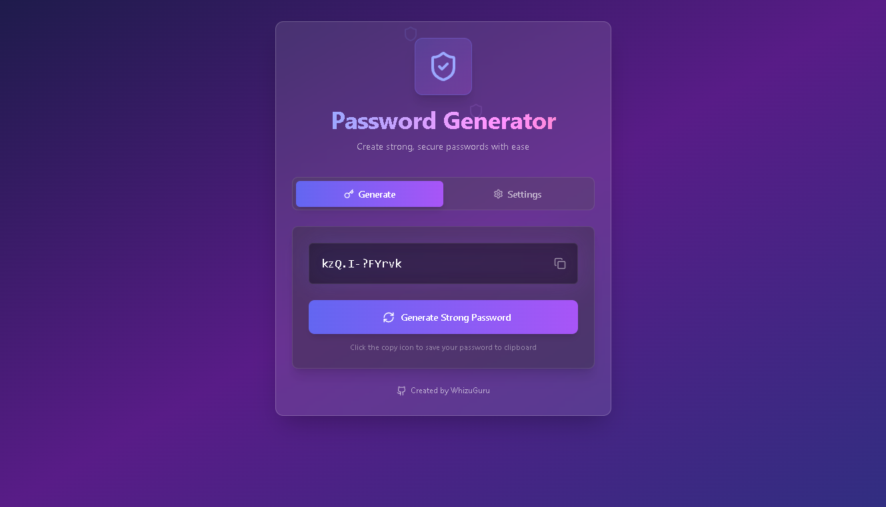
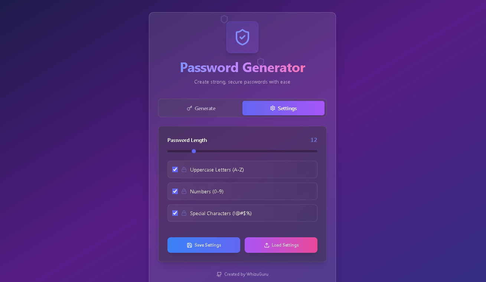

# Générateur de mots de passe

Un générateur de mots de passe moderne et sécurisé créé avec React et TypeScript. Générez des mots de passe robustes avec des options personnalisables pour la longueur, les lettres majuscules, les chiffres et les caractères spéciaux.

## Fonctionnalités

- 🔐 Génération de mots de passe sécurisés
- ⚙️ Personnalisation des critères de mot de passe
- 💾 Sauvegarde et chargement des configurations
- 📋 Copie en un clic dans le presse-papiers
- 🎨 Interface moderne et responsive

## Pour commencer

### Prérequis

- Node.js (version 16 ou plus récente)
- npm ou yarn

### Installation

1. Clonez le dépôt :
```bash
git clone https://github.com/WhizuGuru/password-generator.git
cd password-generator
```

2. Installez les dépendances :
```bash
npm install
# ou
yarn install
```

3. Lancez le serveur de développement :
```bash
npm run dev
# ou
yarn dev
```

4. Ouvrez votre navigateur et visitez `http://localhost:5173`.

Voici deux images décrivant ce Password-Generator -> 


